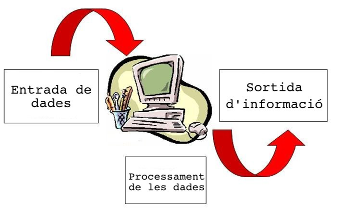
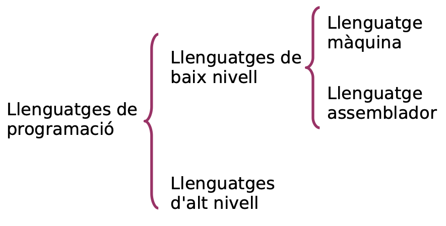
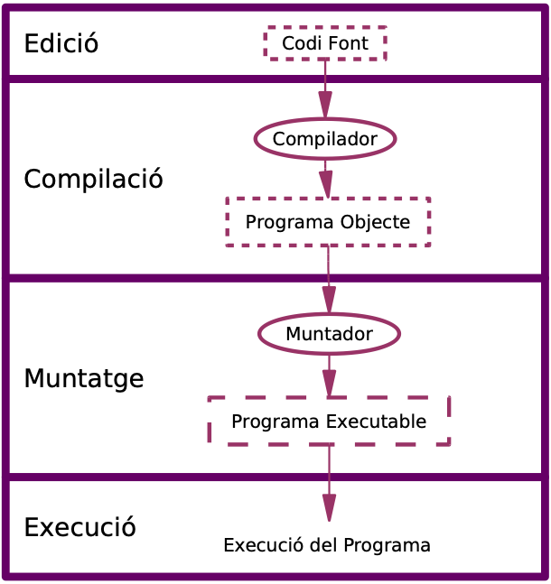
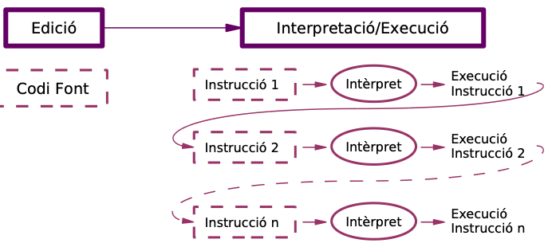
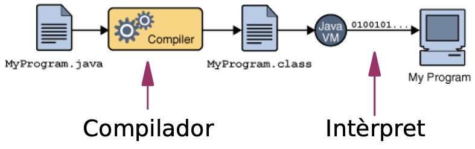
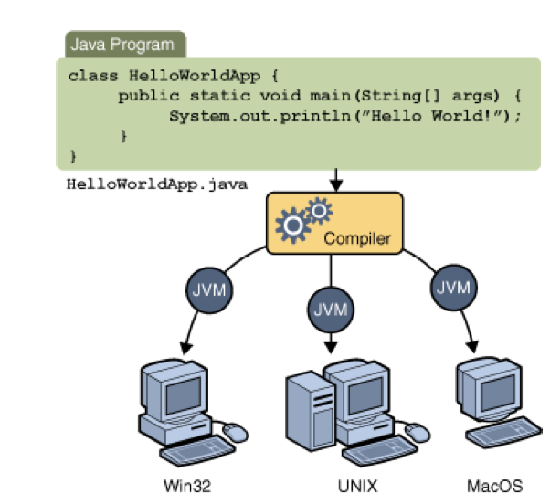

# 1. Algorismes i llenguatges

Per a començar amb aquest curs, cal repassar algunes consideracions molt bàsiques (i molt ràpidament) de conceptes que tenim que tindre molt clars.

## 1.1 Programa i programació

!!! note "Definicions bàsiques"
    - El **client** és qui diu les seues necessitats.
    - Un **analista** és aquella persona que s'encarrega de especificar qué ha de fer el programa, a partir del requisits que li ha dit el client.
    - Un **dissenyador** és aquell que perfila l'algorisme a seguir per a solucionar els requeriments del client.
    - Un **programador/a** és aquella persona que s'encarrega de codificar programes, segons l'algorisme dissenyat.
    - **Usuari/a** és el terme que s’utilitza per referir-se a la persona que fa servir una aplicació informàtica amb la intenció d’aconseguir un resultat final. La persona que treballarà amb el programa final.

Tenint tots els rols clars:

!!! note "Més definicions"
    - Un **algorisme** és un mètode de resolució d’un problema en un nombre finit de passos. Exemple: com es fa una truita a la francesa?
    - A partir de l'algorisme un **programa** és l’expressió d’un algorisme en un llenguatge entenedor per l’ordinador. 
    - La **programació** és la seqüència de passos que ha d’efectuar el/la programador/a per obtenir un programa.
    - Una **aplicació informàtica** és un conjunt de programes enllaçats de manera convenient, per exemple un client i un servidor.
    - Els programes manipulen dades d'entrada per produir altres de sortida.

Podeu ampliar la informació a la següent infografia: [Infografia sobre algoritmes](https://www.goconqr.com/ficha/16775535/algoritmos-computacionales)

## 1.2 Algorisme vs Programa

Hem parlat que necessitem un algorisme per a resoldre un problema, pero a més a més el volem resoldre amb un llenguatge de programació. El problema és que el llenguatge de programació sol ser una sèrie d'instruccions més o menys entendibles pel programador, i això no ho enten el processador sobre el que s'executa el programa. Es necessita un procés de traducció entre el llenguatge de programació (text) i el llenguante màquina (emmetxador o binari directament) que és el que enten el processador.

Atesos a la proximitat del processador, distinguim entre:

### 1.2.1 Llenguatge compilat
Els llenguatges compilats són aquells que es realitza una traducció total de les instruccions que formen el programa.

Els grans exemples de llenguatges compilats són C i C++. En dits llenguatges a partir del codi font (fitxer de text) es crea el fitxer executable, que ja pot llançar-se de manera independent.

> Aquest llenguatges no son portables, ja que sols funcionen en la màquina a la qual es compila. Necessitem compiladors d'aquest llenguatges per a diverses màquines i sistemes operatius.

### 1.2.2 Llenguatge interpretat

Els llenguatges interpretats realitzen traduccions parcials de cada linia o bloc de codi font i van execunat-lo poc a poc (traduisc-execute i anem repetint). Aquest llenguatges requereixen un intèrpret que és qui fa eixa execució. El gran representant d'aquest llenguatge és **Python**.

> Són molt portables,  ja que aquest codi permet ser executat per qualssevol màquina, sempre que tinga l'intèrpret instal·lat al seu sistema.

### 1.2.3 Llenguatges mixtes

Hi han llenguatges intermedis, que fan un primer pas de compilació, el resutat del qual són unes instruccions que permet ser executades per un intèrpret. El gran representant és el llenguatje **Java**.

## 1.3 Llenguatges segons el seu ús

Depenent de la destinació dels programes, hem d'escollir uns o altres llengutges de programació. Anem a veure una xicoteta classificació de per a que podem fer servir cada llenguatge:

- `C`: llenguatge molt potent. Hui en dia es fa servir per a programar sistemes operatius i microcontroladores, per él seu accés a baix nivell. També es fa servir per a programar llibreries que faran servir altres llenguatges com per exemple Python.
- `Java`: llenguatge pensat per a la creació de programes de propòsit general, amb accès a bases de dades i servidors. També permet la programació de dispositius d'oci.
- `Python`: llenguatge de propòsit general, amb una gran col·lecció de llibreries que permeten desenvolupar programes de qualsevol naturalesa. Es fa servir molt per a IA, fent servir llibreries programades en C, com hem comentat abans.
- `node/javascript`: llenguatge pensat per a la programació de servidors ràpid i escalable. S'integra molt be amb els navegadors web.
- `php`: llenguatge pensat per a la programació de servidors.
- `R`: llenguatge pensant per a l'anàlisi de dades i big data, així com representació de la informació.
- `Kotlin`: llenguatge que permet combinar i incloure codi Java. Actualment pensat pera desenvolupament en Android.

